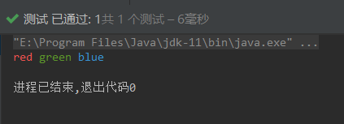
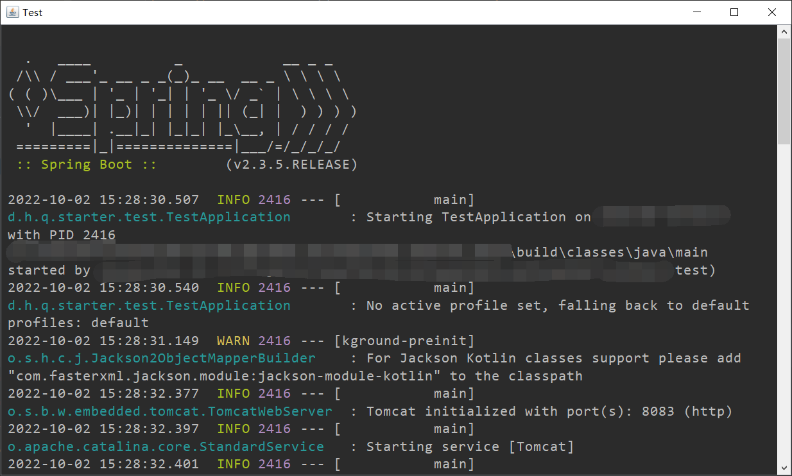
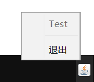

# Honoka SDK

[](./LICENSE)

[](../../releases)

## 简介
Honoka SDK是一款包含了各式各样实用工具的Java工具包，主要包含honoka-utils、honoka-json等模块。提供了包括简写代码、读取文件、后台运行jar包、读取CSV表格、处理Emoji、文字转图片、反射操作、方便易用的统一的JSON API等功能的诸多工具类。

本项目采用Apache-2.0 License，使用本项目时，请遵守此开源许可证的相关规定。

**本项目中的所有代码并未经过严格测试，请勿用于生产环境。**

请参阅：[更新日志](./docs/changelog.md)

## 功能展示
### [ColorfulText](./honoka-utils/src/main/java/de/honoka/sdk/util/code/ColorfulText.java)
用于方便地在控制台输出彩色文字。
```java
ColorfulText.of().red("red ").green("green ").blue("blue").println();
```


### [ConsoleWindow](./honoka-utils/src/main/java/de/honoka/sdk/util/system/gui/ConsoleWindow.java)
这是一个使用Java AWT与Swing等组件编写的一个控制台窗口，它可以通过系统托盘图标的方式，使任何可执行jar包能够在系统后台运行。

控制台窗口关闭后，jar包将继续保持在后台运行，点击jar包对应的系统托盘图标，可再次打开控制台窗口。
```java
public static void main(String[] args) {
    //of方法参数：控制台窗口标题
    //setOnExit：执行托盘右键菜单中的“退出”项时，要执行的代码段
    /*
     * setScreenZoomScale：当前系统的屏幕缩放比例大小，用于准确定位右键弹出菜单
     * 若不正确设置，则弹出菜单的位置可能会与鼠标点击的位置存在较大偏差
     */
    ConsoleWindow.Builder.of("Test").setOnExit(() -> {
        System.out.println("系统退出");
    }).setScreenZoomScale(1.25).build();
    SpringApplication.run(TestApplication.class, args);
}
```
控制台窗口：



系统托盘图标：



### [FileUtils](./honoka-utils/src/main/java/de/honoka/sdk/util/file/FileUtils.java)
#### copyResourceIfNotExists()
检查当前运行的jar包外部是否含有指定的资源文件，若有则忽略此资源，若没有，则从jar包中指定的相对路径处，提取此资源复制到jar包外部相同的相对路径处。

例如，设指定的路径为`/dir/file.txt`，则先判断jar包所在目录下是否存在`./dir/file.txt`文件，若没有，则从指定类所在的jar包中提取`/dir/file.txt`文件，放置于当前jar包目录下的`./dir/file.txt`这一位置。
```java
//参数1：要提取的资源所在的jar包中的某个类，用于基于它获取资源的URL
//参数2：要提取的资源路径，可以为多个
FileUtils.copyResourceIfNotExists(ClassInJar.class, "/dir/file1.txt", "/dir/file2.txt");
```
执行完上述代码后，当前运行的jar包所在目录下的`dir`文件夹下应该有`file1.txt`与`file2.txt`两个文件。

#### getClasspath()
用于获取当前运行的jar包所在的目录的路径，或所运行的class文件的classpath根目录。

设一个Gradle项目在不打包的情况下，直接运行时，其根目录的路径为：`C:\Projects\a-project`。

则这个方法的返回值类似于：
```
C:\Projects\a-project\build\classes\java\main
```
当某个可执行jar包在执行此方法时，此方法的返回值即为jar包所在的目录的路径。

#### urlToString()
将一个URL所对应的资源直接转换为字符串，编码采用JVM运行时的默认编码。

主要用于直接读取jar包中的文本文件。

### [ImageUtils](./honoka-utils/src/main/java/de/honoka/sdk/util/various/ImageUtils.java)
文字转图片工具类，转换时图片的高度是自适应的，图片的宽度可以自行指定。可以指定每行最大字符数，或是为图片指定一个固定宽度。此外，它还具有一定的渲染HTML的能力。

### [ReflectUtils](./honoka-utils/src/main/java/de/honoka/sdk/util/various/ReflectUtils.java)
强大的反射工具类，可以方便地获取和修改被`private`和`final`所修饰的字段的值，以及方便地自动查找和调用指定名称的`private`方法，具有一定的类型推断能力。

```java
//获取某个定义的字段，并调整可访问性，默认移除final修饰符（如果有）
Field getField(Class<?> clazz, String fieldName);
//设置某个对象的一个成员的值
void setFieldValue(Object obj, String fieldName, Object value);
//设置static字段的值
void setFieldValue(Class<?> clazz, String fieldName, Object value);
//调用某个方法，根据参数值列表，自动推断要查找的方法的参数类型列表
Object invokeMethod(Object obj, String methodName, Object... args);
//调用某个方法
Object invokeMethod(Object obj, String methodName, Class<?>[] parameterType, Object... args);
```
使用此工具类，可以避免手动查找获取字段和方法，以及调用`setAccessible()`的麻烦。

### [JsonObject](./honoka-json/honoka-json-api/src/main/java/de/honoka/sdk/json/api/JsonObject.java)
强大的JsonObject API，支持按路径查找、按类型取值、转化为格式化与非格式化字符串等功能。

设有如下json对象：
```json
{
  "a": 1,
  "level1": {
    "b": 2,
    "level2": {
      "c": 3
    }
  }
}
```
要解析此字符串，并获取`level1.level2.c`的值，只需：
```java
JsonObject.of(str).getInt("level1.level2.c");
```

### [JsonArray](./honoka-json/honoka-json-api/src/main/java/de/honoka/sdk/json/api/JsonArray.java)
强大的JsonArray API，支持泛型、按泛型取值、按泛型类型遍历等功能。

设有如下json对象：
```json
[
  {
    "a": 1,
    "b": 2
  },
  {
    "a": 3,
    "b": 4
  }
]
```
另有以下Java类定义：
```java
class Entity {
    int a, b;
}
```
要将其中的每个对象转化为`Entity`实例后遍历，只需：
```java
JsonArray<Entity> array = JsonArray.of(str, Entity.class);
for(Entity e : array) {
    System.out.println(e.a);
    System.out.println(e.b);
}
```
不再需要像常见的json框架一样，将从`JsonArray`中取出来的值，做一次强转。

### 更多实用工具
请阅读源代码以了解更多实用工具类的功能。

## 使用
本项目部署于：

[](https://github.com/kosaka-bun/maven-repo)

使用前请先阅读此仓库的文档，为你的Maven或Gradle添加依赖仓库。

各模块版本号请前往[Releases](../../releases)查看。

### Maven
```xml
<dependencies>
    <dependency>
        <groupId>de.honoka.sdk</groupId>
        <artifactId>honoka-utils</artifactId>
        <version>版本号</version>
    </dependency>

    <dependency>
        <groupId>de.honoka.sdk</groupId>
        <artifactId>honoka-json-gson</artifactId>
        <!-- 或：<artifactId>honoka-json-fastjson</artifactId> -->
        <version>版本号</version>
    </dependency>
</dependencies>
```

### Gradle
```groovy
dependencies {
    implementation 'de.honoka.sdk:honoka-utils:版本号'
    implementation 'de.honoka.sdk:honoka-json-gson:版本号'
    //或：implementation 'de.honoka.sdk:honoka-json-fastjson:版本号'
}
```
