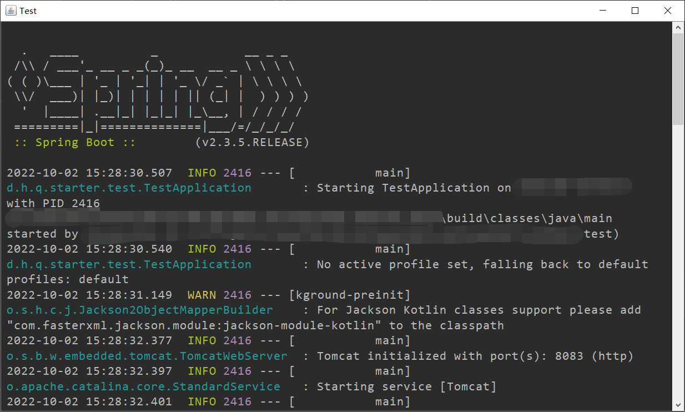
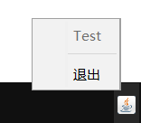

# Honoka SDK


<br />
[](./LICENSE)

[](../../releases)

## 简介
Honoka SDK是一款包含了各式各样适用于多种语言和平台的实用工具的工具包，主要包含honoka-sdk-jvm、honoka-sdk-android、honoka-sdk-js等子项目，每个子项目下又各自有多个模块。

honoka-sdk-jvm模块提供了包括简写代码、读取文件、后台运行jar包、读取CSV表格、处理Emoji、文字转图片、反射操作等功能的诸多Java与Kotlin工具类和DSL函数。

honoka-sdk-android模块针对Android基本组件（`ContentProvider`、`Service`）、OrmLite框架、Ktor Server、`WebView`等进行了高度封装，提供了许多默认实现和便捷的方法。

honoka-sdk-js模块提供了Web开发中的一些常用工具函数，以及一些在Android WebView中使用的扩展工具等。

本项目采用Apache-2.0 License，使用本项目时，请遵守此开源许可证的相关规定。

**本项目中的所有代码并未经过严格测试，请勿用于生产环境。**

请参阅：[更新日志](./docs/changelog.md)

## 功能展示（JVM）
### [ConsoleWindow](./honoka-sdk-jvm/honoka-utils/src/main/java/de/honoka/sdk/util/gui/ConsoleWindow.java)
这是一个使用Java AWT与Swing等组件编写的一个控制台窗口，它可以通过系统托盘图标的方式，使任何可执行jar包能够在系统后台运行。

控制台窗口关闭后，jar包将继续保持在后台运行，点击jar包对应的系统托盘图标，可再次打开控制台窗口。
```java
public static void main(String[] args) {
    //of方法参数：控制台窗口标题
    //setOnExit：执行托盘右键菜单中的“退出”项时，要执行的代码段
    /*
     * setScreenZoomScale：当前系统的屏幕缩放比例大小，用于准确定位右键弹出菜单
     * 若不正确设置，则弹出菜单的位置可能会与鼠标点击的位置存在较大偏差
     */
    ConsoleWindow.Builder.of("Test").setOnExit(() -> {
        System.out.println("系统退出");
    }).setScreenZoomScale(1.25).build();
    SpringApplication.run(TestApplication.class, args);
}
```
控制台窗口：



系统托盘图标：



### [ReflectUtils](./honoka-sdk-jvm/honoka-utils/src/main/java/de/honoka/sdk/util/various/ReflectUtils.java)
强大的反射工具类，可以方便地获取和修改被`private`和`final`所修饰的字段的值，以及方便地自动查找和调用指定名称的`private`方法，具有一定的类型推断能力。

```java
//获取某个定义的字段，并调整可访问性，默认移除final修饰符（如果有）
Field getField(Class<?> clazz, String fieldName);
//设置某个对象的一个成员的值
void setFieldValue(Object obj, String fieldName, Object value);
//设置static字段的值
void setFieldValue(Class<?> clazz, String fieldName, Object value);
//调用某个方法，根据参数值列表，自动推断要查找的方法的参数类型列表
Object invokeMethod(Object obj, String methodName, Object... args);
//调用某个方法
Object invokeMethod(Object obj, String methodName, Class<?>[] parameterType, Object... args);
```
使用此工具类，可以避免手动查找获取字段和方法，以及调用`setAccessible()`的麻烦。

## 功能展示（Android）

### [BaseContentProvider](./honoka-sdk-android/honoka-android-utils/src/main/java/de/honoka/sdk/util/android/basic/ContentProvider.kt)
能基于`call`方法，实现与其他应用通过JSON数据进行通信的`ContentProvider`。继承该类时，仅需实现一个方法：
```kotlin
//JSON类来自于hutool，是JSONObject和JSONArray的父类
abstract fun call(method: String?, args: JSON?): Any?
```

返回值类型可以是任何基本数据类型、`String`、任何实体类或任何实体类的集合（即任何能够被存放在`JSONObject`对象中的类型）。

在一个应用中调用另一个应用提供的基于`BaseContentProvider`实现的`ContentProvider`时，可使用本工具包所提供的两个方法中的任意一个：
```kotlin
//返回值类型可能为JSONObject、JSONArray或基本数据类型
fun ContentResolver.call(authority: String, method: String? = null, args: Any? = null): Any?

//基于上述方法返回的值，尝试将其转换为指定类型的实体类或集合
inline fun <reified T> ContentResolver.typedCall(
    authority: String, method: String? = null, args: Any? = null
): T
```

**注：基于`BaseContentProvider`实现的`ContentProvider`仍需在`AndroidManifest.xml`中注册。**

### [BaseDao&lt;T&gt;](./honoka-sdk-android/honoka-android-utils/src/main/java/de/honoka/sdk/util/android/database/BaseDao.kt)
基于OrmLite封装了常用CRUD方法的基础DAO类，支持自动建库建表（单库单表，一个`.db`文件中只包含一张表）、自动升级降级数据表、基于OrmLite的`QueryBuilder<T, ID>`编写查询DSL等功能。

要使用`BaseDao<T>`，需先按以下示例创建一个实体类：
```kotlin
import com.j256.ormlite.field.DatabaseField
import com.j256.ormlite.table.DatabaseTable
import de.honoka.sdk.util.android.database.Table

/*
 * @Table(version = 1)代表该实体类所对应的.db文件（单库单表）中的数据库的版本，若该实体类所对应
 * 的BaseDao的子类在被初始化时，检测到应用数据目录中的该实体类所对应的.db文件与此处定义的版本不符，
 * 则触发数据表的自动升级降级。
 */
@Table(version = 1)
@DatabaseTable(tableName = "some_entity")
data class SomeEntity(

    @DatabaseField(id = true)
    var id: String? = null,

    @DatabaseField
    var name: String? = null,

    @DatabaseField
    var enabled: Boolean? = null
)
```

然后创建一个`object`类（Kotlin中的单例对象），继承`BaseDao`，将此类作为泛型和`KClass<*>`对象传入：
```kotlin
object SomeEntityDao : BaseDao<SomeEntity>(SomeEntity::class)
```

在任何一个地方首次调用`SomeEntityDao`中的任何成员（包括继承的成员）时，其所继承的来自`BaseDao`中的成员才会被初始化，此时才可能会触发数据表的升级或降级。

若想在应用启动时就初始化所有`BaseDao`的子类，可在项目中创建任意一个继承`AbstractAndroidDatabaseUtils`类的自定义子类，并在实现抽象属性`daoInstances`时，引用每一个需要被初始化的`BaseDao`的子类，并在应用启动时即调用该子类的`initDaoInstances()`方法。

### [AbstractWebActivity](./honoka-sdk-android/honoka-android-utils/src/main/java/de/honoka/sdk/util/android/activity/WebActivity.kt)
仅包含一个全屏`WebView`的`Activity`的子类，其中包含了针对网页触发的全局全屏（可使状态栏隐藏的全屏，通常由网页中的视频播放器触发）的默认实现、全局全屏（横屏）时的重力感应旋屏、返回键触发网页后退、将`Activity`事件传递到`WebView`中的JavaScript层的实现、自动注册多个包含`JavascriptInterface`或`AsyncJavascriptInterface`的对象等功能。

要使用`AbstractWebActivity`，可选择直接使用`DefaultWebActivity`，或继承`AbstractWebActivity`创建一个自定义的`Activity`，然后实现抽象属性`definedJsInterfaceInstances`，传入包含`JavascriptInterface`方法的一个或多个类的实例列表，例如：

```kotlin
class WebActivity : AbstractWebActivity() {

    override val definedJsInterfaceInstances: List<Any> = listOf(
        AnyJsInterface()
    )

    override fun extendedOnResume() {
        //需要在onResume方法被调用时执行的额外操作
    }
}
```

有关`AsyncJavascriptInterface`方法的实现原理，请参考源代码。

### [HttpServer](./honoka-sdk-android/honoka-android-utils/src/main/java/de/honoka/sdk/util/android/server/HttpServer.kt)
基于Ktor框架实现的HTTP服务，能使应用具有监听端口，对外提供HTTP服务的功能。

要使应用启动一个HTTP服务，只需直接调用`HttpServer.createInstance()`即可。`HttpServer`所监听的默认端口为`38081`，服务启动前将会检测端口占用情况，若端口被占用，则自动依次按端口号向下寻找可用的端口号，最多寻找10个端口号。若希望更改默认端口号，仅需在调用`createInstance()`前，修改`HttpServerVariables.serverPort`的值即可。

默认情况下，`HttpServer`仅提供静态资源服务，包含以下URL与静态资源的映射:

|            URL             |            静态资源            |
|:--------------------------:|:--------------------------:|
| `/`、`/index.html`、任何未定义的路由 | `[assets]/web/index.html`  |
|        `/assets/**`        |  `[assets]/web/assets/**`  |
|         `/font/**`         |   `[assets]/web/font/**`   |
|         `/img/**`          |   `[assets]/web/img/**`    |
|          `/js/**`          |    `[assets]/web/js/**`    |
|       `/favicon.ico`       | `[assets]/web/favicon.ico` |
|     `/android/img/**`      | `[Application.dataDir]/**` |

要添加自定义路由及其处理逻辑，可在调用`createInstance()`前，为`customRoutingList`变量重新赋值一个包含自定义路由定义的`List`。

`customRoutingList`中的成员均为`io.ktor.server.routing.Routing`类的扩展函数，请参考Ktor官方文档了解如何基于编写`Routing`的扩展函数的方式，编写自定义路由的处理逻辑。

## 更多实用工具
请阅读源代码以了解更多实用工具类的功能。

## 使用
本项目部署于：

[](https://github.com/honoka-studio/maven-repo)

使用前请先阅读此仓库的文档，为你的Maven或Gradle添加依赖仓库。

各模块版本号请前往[Releases](../../releases)查看。

### Maven
```xml
<dependencies>
    <dependency>
        <groupId>de.honoka.sdk</groupId>
        <artifactId>honoka-utils</artifactId>
        <version>版本号</version>
    </dependency>

    <dependency>
        <groupId>de.honoka.sdk</groupId>
        <artifactId>honoka-kotlin-utils</artifactId>
        <version>版本号</version>
    </dependency>
</dependencies>
```

### Gradle
#### Groovy DSL
```groovy
dependencies {
    implementation 'de.honoka.sdk:honoka-utils:版本号'
    implementation 'de.honoka.sdk:honoka-kotlin-utils:版本号'
    implementation 'de.honoka.sdk:honoka-android-utils:版本号'
}
```

#### Kotlin DSL
```kotlin
dependencies {
    implementation("de.honoka.sdk:honoka-utils:版本号")
    implementation("de.honoka.sdk:honoka-kotlin-utils:版本号")
    implementation("de.honoka.sdk:honoka-android-utils:版本号")
}
```
